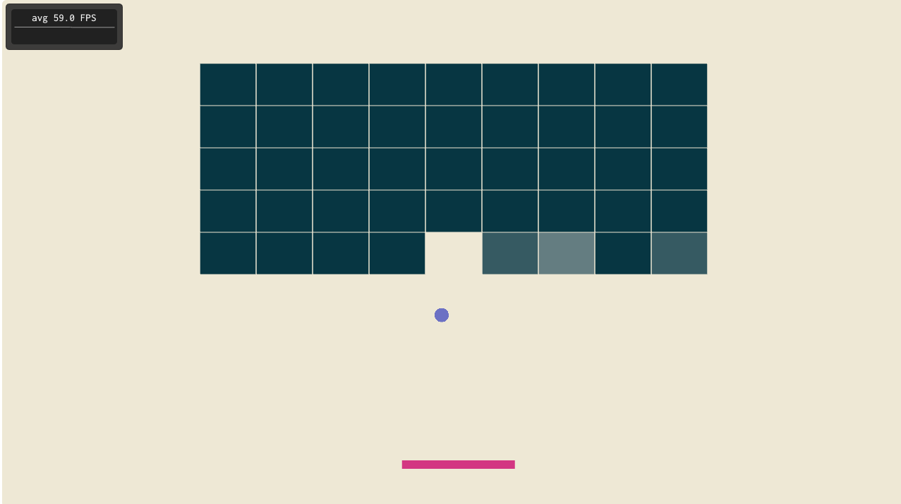

# Introdução

O \textsc{Arkanoid}[^arkanoid] é um jogo simples no gênero de *block
breakers*, lançado originalmente em 1986. O jogo consiste em um *grid*
de blocos, que devem ser quebrados por colisões com uma *bola*. A bola
é guiada pelo usuário por meio de uma "raquete", ou *paddle*. O paddle
pode ser movido para a esquerda e para a direita, e o jogo corre com a
bola rebatendo no paddle.

[^arkanoid]: [https://en.wikipedia.org/wiki/Arkanoid](https://en.wikipedia.org/wiki/Arkanoid)

Nesse sentido, o presente relatório disserta sobre o desenvolvimento
do \textsc{GL-Ball}, um clone simples do \textsc{Arkanoid}. Ele recebe
esse nome em homenagem ao \textsc{DX-Ball}, um outro clone do mesmo
jogo. O \textsc{GL-Ball} implementa a jogabilidade básica do estilo,
com os blocos, a bola e o paddle. O jogador vence o jogo quando quebra
todos os blocos, e perde se a bola sai da tela para baixo do paddle.

\newpage

# Controles

O jogo usa dois mapas de controle: um usando as setas do teclado, e
outro inspirado no editor de texto `vi`.

- `←` ou `h`: mover o paddle para a esquerda;
- `→` ou `l`: mover o paddle para a direita.

# Arquitetura

A implementação é feita de tal forma que a renderização e atualização
de estado do jogo são separadas. Cada componente do jogo é
implementado em uma classe específica, que cuida da lógica de
jogabilidade de tal componente. A saber, são três componentes básicos:
`Block`, `Ball` e `Paddle`, implementados, respectivamente, nos
arquivos `block.hpp`, `ball.hpp` e `paddle.hpp`

A renderização desses componentes fica sob responsabilidade das
classes `*Renderer` (notadamente `BlockRenderer`, `BallRenderer` e
`PaddleRenderer`). Cada uma dessas classes inicializa um `VAO` e um
`VBO` específico em seu construtor, e seu método `render` recebe uma
referência ao componente em questão e popula `uniforms` nos `shaders`
conforme os dados de jogo desses componentes.

A lógica de jogo é feita toda usando coordenadas em espaço de
*mundo*. Ou seja, as coordenadas usadas em cálculos de colisão ou
movimento não são necessariamente as mesmas passadas para a GPU na
hora da renderização. Em verdade, todos os vértices criados nos `VBOs`
têm posições fixas, assumindo `(0,0)` como o centro do espaço de
*modelo*.

Durante a renderização, são criadas matrizes que escalam e movem para
a posição correta os vértices existentes no `VAO` correspondente ao
componente sendo renderizado. Essas matrizes levam as posições de
espaço de *modelo* em espaço de *mundo*.

Também, é utilizada uma matriz de projeção ortogonal que ao final do
processo transforma as posições de espaço de mundo para espaço de
*janela*. Essa matriz é criada levando em consideração a geometria da
janela, portanto o jogo não fica distorcido dependendo da resolução
escolhida.

Todas essas matrizes são passadas para a GPU por meio das `uniform`s
acima mencionadas[^matrices].

[^matrices]: Sei que, nesse ponto do curso, matrizes acabaram de ser
introduzidas e imagino que não seriam cobradas nesse projeto. No
entanto, usei elas porque já tenho experiência com computação
gráfica, e usá-las me ajudou a modelar o jogo melhor.
	
Note que, desta maneira, é criado apenas um `VBO` e um `VAO` por tipo
de componente, ao invés de um par desses por instância de cada
componente, economizando memória na GPU. Em contrapartida, é gerada
uma chamada de desenho por instância, o que pode ser uma fonte de
perda de performance.

## `BallRenderer`

Enquanto tanto o `BlockRenderer` quanto o `PaddleRenderer` funcionam
de maneira idêntica, desenhando quadriláteros como a composição de
dois triângulos e usando o modo `GL_TRIANGLES`, o `BallRenderer` age
de maneira diferente. O `VBO` em questão contém apenas um vértice, a
posição `(0,0)`. Esse vértice é renderizado usando o modo `GL_POINTS`,
posicionado no *vertex shader* a partir da posição em espaço de mundo
da bola e multiplicado pela matriz de projeção.

O formato de círculo é gerado no *fragment shader*, a partir da
equação do círculo:

\begin{equation*}
	x^2 + y^2 \leq r^2
\end{equation*}

A saber, usa o `gl_PointCoord` e preenche a cor se a distância do
fragmento até o centro do ponto satisfaz a equação do círculo. Se não,
preenche com transparente.

## Lógica de colisões

A checagem de colisões é feita entre a bola e os demais componentes[^quad_tree],
em todo frame. O algoritmo de colisão com os blocos é implementado no
arquivo `quad_tree.cpp`, em especial na classe `QuadTreeLeaf`.

[^quad_tree]: Como pode ver nos arquivos `quad_tree.{hpp,cpp}`, existe
uma implementação de uma *quadtree*, que tem como objetivo diminuir o
número de testes de colisão feitos durante um frame. Como escrevi nos
comentários, optei por não utilizar essa lógica de pesquisa e basear o
jogo apenas nas folhas de uma árvore dessas. Mantive a implementação
porque pode ser útil no futuro.

O tratamento de colisão com o paddle é mais interessante, e está no
arquivo `paddle.cpp`. Quando a bola bate no paddle, deseja-se mudar a
direção na bola dependendo de em que posição no paddle essa colisão
aconteceu. Ou seja, se a bola bate à esquerda do paddle, ela deve ser
refletida com um *bias* à esquerda, e equivalente à direita. 

Essa funcionalidade é implementada observando o paddle como um
segmento de reta entre dois pontos, $A$ e $B$. O ponto onde a bola
colide com o paddle é o ponto $p$, colinear com $A$ e $B$. Deste modo,
podemos modelar $p$ como uma interpolação linear entre $A$ e $B$, com
um parâmetro $\alpha \in [0, 1]$. Deste modo, conseguimos utilizar
$\alpha$ para parametrizar a normal do paddle, obtendo assim o
comportamento desejado.

O parâmetro $\alpha$ pode ser obtido a partir dos pontos $A$,
$B$ e $p$. Considerando esses três pontos em $\mathbb{R}$, segue:

\begin{align*}
	p 
	&= \alpha A + (1 - \alpha) B \\
	&= \alpha A + B - \alpha B \\
	&= B + \alpha (A - B) \\
	\Rightarrow \alpha &= \frac{p - B}{A-B}
\end{align*}

Assim, basta rotacionar a normal do paddle por
$\operatorname{arcsin}(2\alpha -1)$, e utilizar o vetor resultante
para refletir a bola no momento da colisão.

# Considerações finais

Durante a jogatina, é possível perceber que o tratamento de colisão
não é correto em algumas ocasiões, a saber quando há ambiguidade sobre
a colisão ser tratada por duas faces adjacentes. Portanto, uma
implementação mais cuidadosa do tratamento de colisão nesses casos é
uma possível melhoria.

Embora a implementação atual promova certo grau de separação de
domínios, especialmente nos `Renderer`s, talvez seja interessante
pensar numa outra abstração, como o modelo de
Entidades-Sistemas-Componentes.

As cores utilizadas no projeto foram baseadas na paleta
*Solarized*[^solarized], de Ethan Schoonover.

[^solarized]: [https://ethanschoonover.com/solarized/](https://ethanschoonover.com/solarized/)
