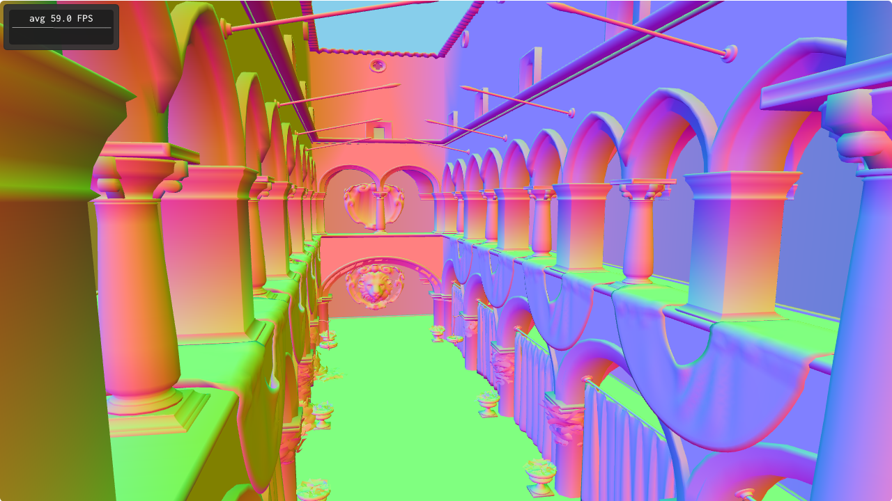

# Introdução

A cena Crytek Sponza é uma recriação digital do Palácio de Sponza, em
Dubrovnik, na Croácia. Pela quantidade de polígonos, nível de
detalhamento e possibilidades de materiais e de iluminação, é uma cena
muito comumente usada como referência em demonstrações de tecnologias
gráficas.

Considerando o status dessa cena, o atual projeto consiste numa *demo*
onde o usuário pode, por meio do teclado, navegar por toda a cena. Por
questões de escopo de projeto, a cena é renderizada utilizando os
vetores normais dos vértices como cores, não havendo por enquanto
cálculo de iluminação, sombras, texturas e oclusão. Essas três
primeiras *features* serão estudadas e implementadas ao longo do
terceiro projeto da disciplina, que será uma continuação deste.

O modelo utilizado foi retirado [deste
repositório](https://github.com/jimmiebergmann/Sponza), onde está
livremente disponível.

\newpage

# Controles

A demonstração implementa uma *"fly camera"*, que utiliza o teclado
para controle. Os controles são os seguintes:

- `w` ou `,`: mover a câmera para a frente (*dolly*)
- `s` ou `o`: mover a câmera para trás (*dolly*)
- `a`: mover a câmera para a esquerda (*dolly lateral*)
- `d` ou `e`: mover a câmera para a direita (*dolly lateral*)
- `↑`: rotaciona a câmera para baixo (*pitch*)
- `↓`: rotaciona a câmera para cima (*pitch*)
- `←`: rotaciona a câmera para a esquerda (*yaw*)
- `→`: rotaciona a câmera para a direita (*yaw*)

# Arquitetura

O projeto atual é uma mudança radical em relação ao projeto
anterior. Enquanto o anterior utilizava uma arquitetura levemente
baseada no *visitor pattern*, implementando uma classe *renderer* para
cada entidade do jogo, aqui é utilizada uma abstração muito mais
generalista e desacoplada do domínio da demo.

## O Paradigma ECS

A arquitetura utilizada é baseada no paradigma
*Entity-Component-System* (ECS). De maneira resumida, a aplicação é
composta de *entidades* que vivem em um *mundo*. A essas entidades são
atrelados *componentes*, que armazenam informações sobre a entidade em
questão. O mundo também contém *sistemas*, que iteram sobre todas as
entidades existentes que possuam uma coleção de componentes
determinados, e produzem efeitos no mundo baseado nessa iteração.

Em razão da relativa inexperiência do autor com C++ moderno, somado
aos limites de tempo do projeto, foi optado por utilizar uma
implementação pronta do paradigma ECS[^professor]. A implementação utilizada é um
único *header* C++ escrito por Sam Bloomberg, disponível em
[https://github.com/redxdev/ECS](https://github.com/redxdev/ECS) sob a
licença MIT.

[^professor]: Com permissão do professor!

## Visão Geral da Implementação

Agora, daremos uma visão geral de como a demo é estruturada usando
os conceitos de ECS, e em seguida estudaremos com mais cuidado algumas
faces interessantes da implementação.

A demo consiste, efetivamente, em duas entidades, a saber a câmera e o
modelo da cena. A entidade câmera recebe o componente
`CameraControllerComponent`, que armazena um ponteiro para o objeto
`Camera` a ser usado durante a renderização, junto dos vetores `eye`,
`center` e `up` para realizar os cálculos. Nesse sentido, o mundo
recebe o sistema `CameraSystem`, que itera sobre a entidade que
acabamos de descrever e realiza as necessárias transformações dos
vetores baseadas nas entradas do teclado, abstraídas pela classe `Input`.

A entidade da cena recebe três componentes: `MeshComponent`,
`MaterialComponent`, e `TransformComponent`. Os dois primeiros são
estruturas simples que apenas armazenam uma `std::string` com o nome
do *asset* relevante. O último armazena a posição e a escala da
entidade. Entidades com essa tripla de componentes são iterados pelo
sistema `MeshRendererSystem`, que a partir do `AssetManager` constrói
os objetos `OpenGL` necessários e realiza a renderização propriamente
dita. Os assets serão descritos com mais cuidado na próxima seção.

A construção de todo o mundo ECS e das estruturas de suporte é feita
pela classe `GLWindow`, que serve como interface entre o lado ECS e a
biblioteca `abcg`.

## Assets e o `AssetManager`

Seguindo a metodologia *data-driven* do paradigma ECS, os *assets* são
elementos atômicos que armazenam algum tipo de dado a ser utilizado na
aplicação. Deste modo, a criação e destruição dos assets fica
desacoplada da utilização real deles. Os assets são identificados
utilizando uma `std::string`. A unicidade desse identificador não é
tratada, então dois assets com mesmo nome causariam comportamento não definido.

Todos os assets derivam da classe `Asset`, e implementam métodos
específicos para cada tipo. Existem no projeto dois tipos de asset:

- `MeshAsset`: representa um modelo 3D `OBJ` a ser carregado do sistema de
  arquivos. Faz o carregamento do modelo de maneira *lazy*: não
  carrega imediatamente quando é construído, mas sim na primeira vez
  que é utilizado;
- `ShaderAsset`: representa um *shader program*. Por detalhes de
  implementação, já armazena diretamente o `GLuint` retornado pelo
  `abcg::OpenGLWindow::createProgramFromFile`.

No próximo projeto, será criado um `TextureAsset`.

O `AssetManager` contém uma *hash map* que enfim faz a indexação dos
assets existentes pelos *asset names*, as `std::string`s usadas para
identificação. Utilizando *templates*, a função `get<T:
Asset>(std::string &name)` busca o asset em questão e faz o *casting*
para o tipo de asset desejado. Note que não é feito nenhuma checagem
de corretude de tipos nesse método, e portanto o uso incorreto também
causará comportamento não definido.

## `MeshRendererSystem`

O `MeshRendererSystem` recebe em seu construtor um ponteiro para a
câmera construída acima. Como dito acima, itera sobre entidades que
possuam `MeshComponent`, `MaterialComponent` e
`TransformComponent`. Ele mantém uma *hash map* armazenando os `VAOs`,
indexados pelo nome do `MeshAsset` vindo do
`MeshComponent`. Igualmente ao `MeshAsset`, a criação dos *buffers* é
feita de maneira lazy. Também armazena uma lista dos `VBOs`
separadamente para efetuar a limpeza ao final da execução.

A renderização é feita no método `MeshRenderer::tick`. Ele monta a
*pipeline* fazendo o *bind* do shader advindo do `MaterialComponent`,
e envia para ele como *uniforms* as matrizes de projeção e de
perspectiva, construídas a partir do ponteiro para a câmera da
cena. Em seguida, efetua a *draw call* com o `VAO` indexado pelo nome
de asset do `MeshComponent`.

## `CameraSystem`

A câmera é controlada a partir da entrada do teclado pelo
`CameraSystem`. Nele, são implementados os dois tipos de movimento que
a câmera pode fazer, a saber translação e rotação. 

Inicialmente, são calculados dois vetores. O vetor `forward` é
definido como o vetor da direção da visão, isto é, o vetor normalizado
que liga a posição atual da câmera `eye` ao foco `center`. O vetor
`right`, então, é definido como a normalização do produto vetorial do
vetor `forward` pelo vetor `up`. Como o nome sugere, ele aponta para a
direita da câmera.

A translação é então trivial baseada nesses dois vetores. Aos vetores
`eye` e `center` da câmera, são adicionados um desses vetores
multiplicado por uma escalar, onde a escalar é baseada na velocidade
de translação, na direção do movimento e no *delta time*.

As rotações, por outro lado, envolvem apenas modificações no vetor
`center` da câmera. A ideia é escrever $\overrightarrow{center} =
\overrightarrow{eye} + \overrightarrow{v}$, donde $\overrightarrow{v}
= \overrightarrow{center} - \overrightarrow{eye}$. A partir disso,
rotacionamos $\overrightarrow{v}$ um ângulo $\alpha$ ao redor do vetor
`up` da câmera, resultando num vetor que chamaremos de
$\overrightarrow{v'}$. Daí, a rotação da câmera é finalmente efetuada
pondo $\overrightarrow{center} = \overrightarrow{eye} +
\overrightarrow{v'}$.

# Considerações Finais

Embora o resultado final do projeto seja relativamente simples, a
arquitetura desenvolvida se mostrou bem robusta, e será reaproveitada
para o próximo projeto. De fato, note que as chamadas `OpenGL` ficaram
restritas aos sistemas (com a exceção da criação dos shaders na
`GLWindow`), o que tornaria possível, por exemplo, a substituição
desses sistemas por outros utilizando uma outra API gráfica, sem haver
a necessidade de efetuar mudanças nas lógicas de domínio do projeto.

No próximo projeto, serão implementadas texturas, iluminação, e se
possível (por questões de tempo), sombras primitivas.
