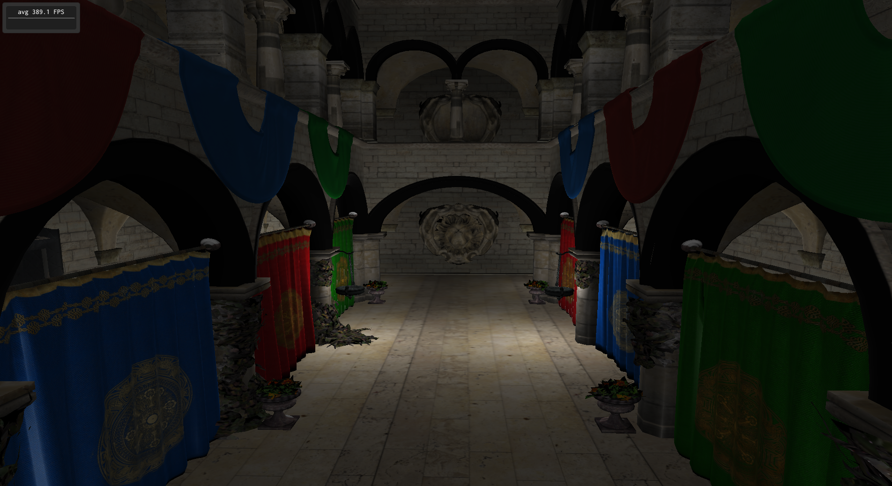
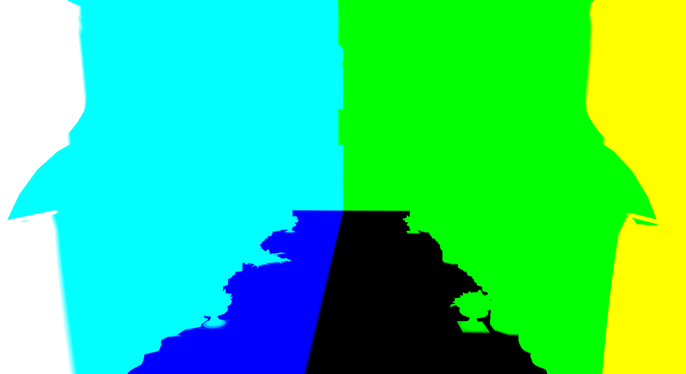
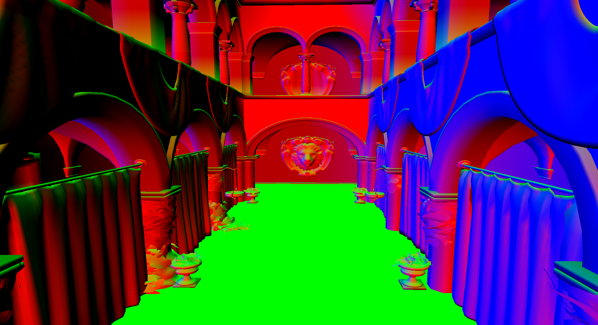
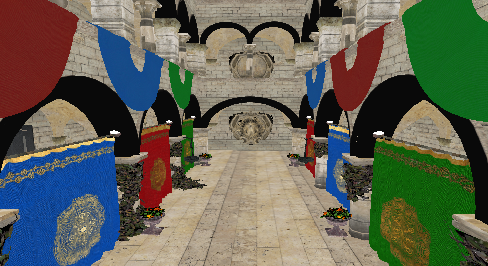

# Introdução

O presente projeto é uma continuação da atividade A2. Portanto, é
necessária uma leitura do [relatório anterior](https://github.com/EduRenesto/abcg/raw/main/reports/a2.sponza.pdf)
para melhor entender esse relatório.

Na atividade A2, foi implementada uma demo que renderiza a cena Crytek
Sponza, utilizando uma arquitetura *data-driven*, baseada no paradigma
ECS. Lá, não era feito nenhum shading especial, e as normais de
vértices eram utilizadas como as cores das malhas.

Na presente iteração, é feito o carregamento de texturas, que são
mapeadas e utilizadas como cor difusa nos elementos da cena. Ainda, é
feito o cálculo de iluminação utilizando o modelo de Phong, a partir
de uma lista arbitrária de fontes de luz.

O foco escolhido nessa atividade foi técnica, em contraste à
interatividade. Nesse tema, a atividade implementa uma técnica de
*deferred rendering*, utilizando um G-Buffer com três *render
targets*. Essa técnica será descrita ao longo do relatório.

# Controles

Os controles são os mesmos que na iteração anterior:

- `w` ou `,`: mover a câmera para a frente (*dolly*)
- `s` ou `o`: mover a câmera para trás (*dolly*)
- `a`: mover a câmera para a esquerda (*dolly lateral*)
- `d` ou `e`: mover a câmera para a direita (*dolly lateral*)
- `↑`: rotaciona a câmera para baixo (*pitch*)
- `↓`: rotaciona a câmera para cima (*pitch*)
- `←`: rotaciona a câmera para a esquerda (*yaw*)
- `→`: rotaciona a câmera para a direita (*yaw*)

# Arquitetura

Essa iteração continua utilizando a arquitetura ECS da atividade
anterior. 

Na classe `MeshAsset`, foi feita uma mudança para que um `MeshAsset`
possa representar mais de um `Mesh`. Essa mudança foi necessária para
que seja viável carregar mais de um material (e portanto textura) por
arquivo `OBJ`, o que é o caso da cena utilizada no projeto. Essa
mudança foi refletida no `MeshRenderer` -- agora, a cena é composta
por múltiplos `VAOs` diferentes, resultando em mais de uma *draw call*
por quadro.

As texturas também são gerenciadas pelo `AssetManager`, descrito no
relatório anterior. As classes `TextureAsset` armazenam o handle
`GLuint` da textura já carregada pelo OpenGL. Essa maneira foi
escolhida para aproveitar as funções de carregamento de imagens
providas pelo `abcg`. O `MeshRenderer` determina qual `TextureAsset`
utilizar na renderização de cada `Mesh` a partir da classe `Material`,
que é carregada do arquivo `MTL` da cena. Além da textura, o
`MeshRenderer` também utiliza o parâmetro $N_s$ vindo do mesmo arquivo
para efetuar os cálculos de iluminação.

# Deferred Rendering

O destaque do projeto, de um ponto de vista técnico, é a utilização de
uma pipeline *deferred* para a renderização da cena. Numa pipeline
tradicional, que utiliza *forward rendering*, a iluminação é calculada
em toda invocação do fragment shader em toda objeto, até mesmo
naqueles que não serão visíveis. Portanto, pode haver desperdício de
tempo de GPU, quando processamento é gasto em fragmentos que não serão
visíveis. Essa perda cresce com o número de polígonos e de fontes de
luz na cena.

Uma técnica para evitar essa perda é, então, *deferred rendering*. A
ideia básica é fazer a renderização em duas etapas, chamadas
*passes*. Na primeira etapa, chamada de *geometry pass*, todas as
malhas da cena são renderizadas utilizando um shader simples,
armazenando os resultados das interpolações que seriam utilizadas para
o eventual cálculo de luz em texturas separadas. Na segunda etapa, o
*lighting pass*, é renderizado apenas um retângulo em tela cheia
utilizando um shader que faz a amostragem das texturas geradas no
passo anterior, utiliza os valores e finalmente faz o cálculo da
iluminação considerando todas as fontes de luz da cena.

Dado que as texturas geradas e usadas contém apenas fragmentos que são
de fato visíveis ao final da renderização, não há desperdício de tempo
de GPU no cálculo de iluminação. Além disso, adicionar uma fonte de
luz na cena implica em apenas mais uma iteração por fragmento do
retângulo tela cheia, e não por fragmento de todas as malhas da
cena. Isso permite números muito grandes de fontes de luz, com grande
flexibilidade.

## O G-Buffer e Render Targets

O conjunto das texturas geradas no *geometry pass* é chamado de
G-Buffer. Ele é implementado utilizando *render targets*, por meio dos
*Framebuffer Objects* do OpenGL. Cada render target pode conter um
número variável de *color attachments*, que são efetivamente
texturas. O fragment shader escreve diretamente nesses attachments: em
termos de OpenGL, se há um color attachment ligado ao slot
`GL_COLOR_ATTACHMENT0 + i`, a saída do fragment shader marcada com
`layout (location = i)` corresponderá exatamente a um fragmento nesse attachment.

A criação e manipulação dos render targets é feita pela classe
`RenderTarget`.

Nesse sentido, o G-Buffer é o atributo `m_gbuffer` da classe
`MeshRenderer`. Nesse projeto, foi utilizado um GBuffer com 3
attachments, cada um armazenando dados diferentes:

- `GL_COLOR_ATTACHMENT0`: posições em espaço de mundo;
- `GL_COLOR_ATTACHMENT1`: vetores normais;
- `GL_COLOR_ATTACHMENT2`: cores difusas (nos componentes `r,g,b`) e
  coeficiente especular (no componente `a`)
  

No Geometry Pass, a cena é desenhada utilizando o shader `gbuffer` e
com o G-Buffer como render target ativo.

Em seguida, no Lighting Pass, as texturas do G-Buffer são usadas e
enviadas como `uniform`s para o shader `deferred`, que é utilizado
para desenhar o fullscreen quad. Nesse mesmo shader, são finalmente
feitos os cálculos de iluminação de todas as superfícies visíveis.

## Fontes de luz

Aproveitando a pipeline deferred, o shader `deferred` suporta um
número arbitrário de fontes de luz. Inicialmente, as posições das
fontes de luz são armazenadas como uma lista no atributo
`m_light_positions` da classe `MeshRenderer`. Na hora da renderização,
tanto essa lista quanto o tamanho dela são enviadas como as uniforms
`_light_positions` e `_total_lights` para o shader. Lá, a função
`phong` é chamada para cada fonte de luz nessa lista, utilizando os
valores amostrados das texturas do GBuffer.

Note que, no código fonte do fragment shader do `deffered`, a array
`_light_positions` tem um tamanho estático de 16 elementos. Isso é
necessário porque arrays em GLSL devem ter tamanho explícito, sendo
essa a razão da outra uniform `_total_lights`. Note que, se a cena
exige mais de 16 fontes de luz, essa constante deve (e pode, sem
problemas) ser aumentada.

# Considerações finais

A meta original para essa última fase do projeto seria implementar,
além da pipeline deferred, a técnica de *shadow mapping*, utilizada
para calcular sombras simples. Nessa técnica, é renderizado um render
target apenas com o depth buffer a partir da perspectiva de cada fonte
de luz, que então é amostrado para calcular se um fragmento está ou
não na sombra dessa fonte de luz.

No entanto, durante a implementação dessa ideia, houveram problemas e
por questões de tempo foi resolvido continuar sem essa técnica.

Dado que o planejamento foi focar em técnica e não em interatividade,
considero esse projeto bem sucedido.

# Observação

O projeto foi desenvolvido e testado numa máquina rodando GNU/Linux,
com uma placa de vídeo AMD RX 570 com os drivers open-source, onde
rodou sem problemas. Também foi testado numa outra máquina GNU/Linux
com uma GPU Intel, e num smartphone rodando Android com uma GPU
Qualcomm, cenários nos quais não houveram problemas. Todos os testes
com a versão WASM foram feitos utilizando o navegador Firefox.

No entanto, num teste feito por um amigo em uma máquina Windows com
uma GPU Nvidia, o projeto não rodou. Como não tenho acesso direto a
essa configuração, não posso debugar especificidades de
drivers. Portanto, peço para que, se possível, execute o projeto em
uma configuração semelhante às usadas nos testes bem-sucedidos
descritos acima.
